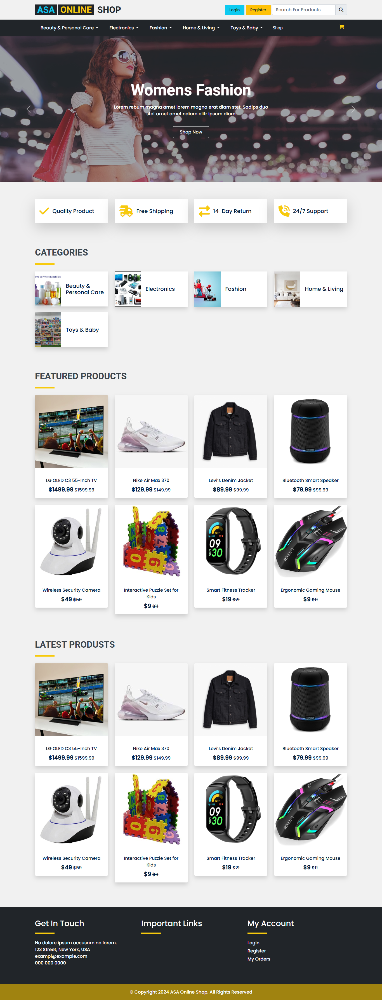
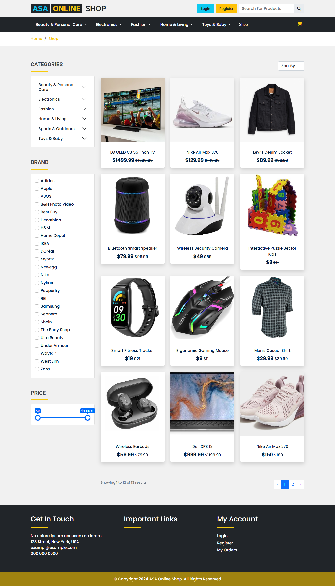
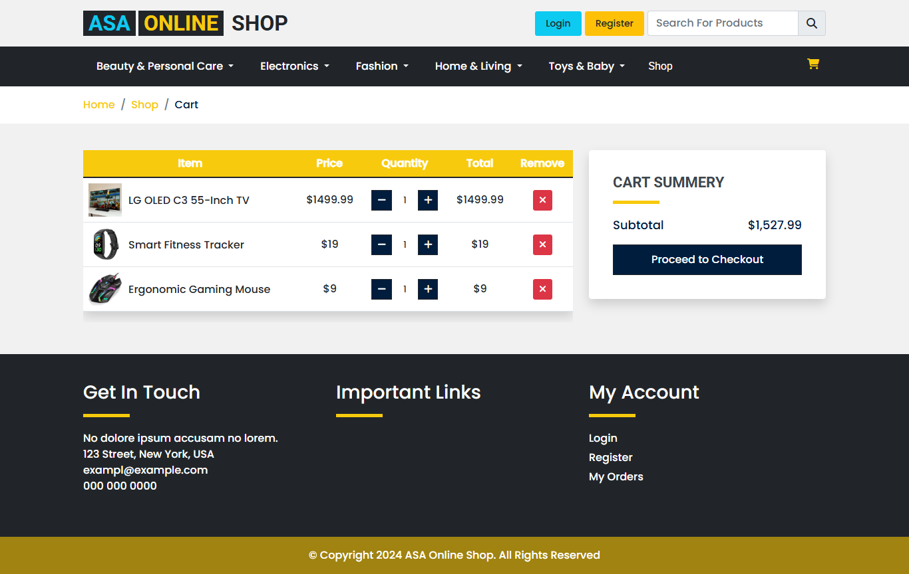
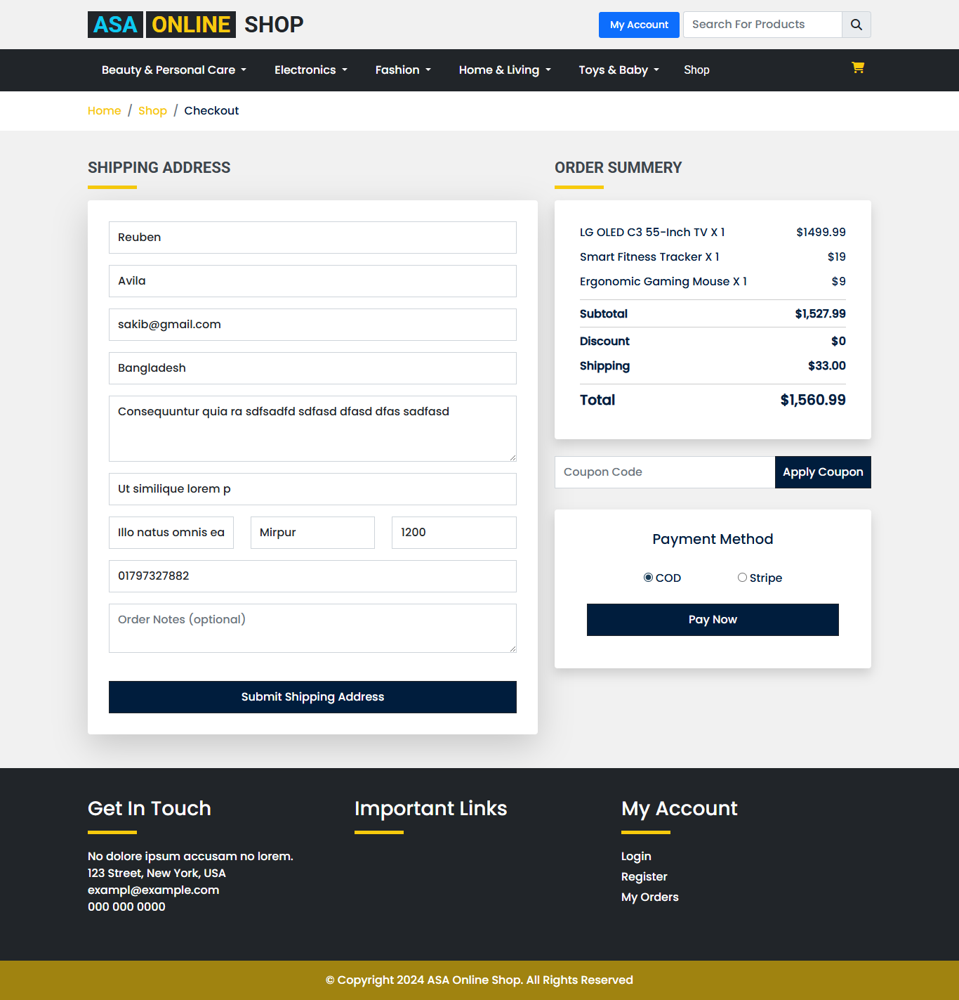

# ASA Online Shop (Laravel)

A full-stack eCommerce web application built with Laravel 11 for browsing products, managing cart and checkout flow, and handling online orders.

## Features

- Product catalog with categories and sub-categories
- Product detail pages with images and ratings support
- Shopping cart and wishlist functionality
- Checkout flow with customer address and shipping handling
- Coupon and discount support
- Stripe payment integration
- Order and order-item management
- Admin-ready data models for brands, pages, and inventory entities

## Tech Stack

- Backend: `PHP 8.2`, `Laravel 11`
- Database: `MySQL` (or any Laravel-supported relational database)
- Frontend build: `Vite`, `Tailwind CSS`, `Alpine.js`
- Payments: `stripe/stripe-php`
- Cart package: `hardevine/shoppingcart`
- Testing: `Pest` / `PHPUnit`

## Project Structure

- `app/Models` -> eCommerce domain models (products, orders, coupons, shipping, etc.)
- `app/Http/Controllers` -> request handling and application logic
- `resources/views` -> Blade templates
- `database/migrations` -> schema definitions
- `database/seeders` -> seed data
- `routes/web.php` -> web routes
- `public/front-assets`, `public/admin-assets` -> static assets

## Getting Started

### Prerequisites

- `PHP >= 8.2`
- `Composer`
- `Node.js` and `npm`
- A database server (`MySQL` recommended)

### Installation

1. Clone the repository:

```bash
git clone https://github.com/alsakib748/ASA-Online-Shop-Laravel.git
cd ASA-Online-Shop-Laravel
```

2. Install backend dependencies:

```bash
composer install
```

3. Install frontend dependencies:

```bash
npm install
```

4. Create environment file and app key:

```bash
cp .env.example .env
php artisan key:generate
```

5. Configure environment variables in `.env`:

- Database settings (`DB_*`)
- Mail settings (`MAIL_*`) for email features
- Stripe settings (`STRIPE_KEY`, `STRIPE_SECRET`)

6. Run migrations (and optional seeders):

```bash
php artisan migrate
php artisan db:seed
```

7. Start development servers:

```bash
php artisan serve
npm run dev
```

Application will be available at `http://127.0.0.1:8000`.

## Useful Commands

```bash
# Run tests
php artisan test

# Build frontend assets for production
npm run build

# Clear and cache config/routes/views
php artisan optimize
```

## Screenshots

### Home Page


### Shop Page


### Product Details


### Add To Cart


### Checkout


## License

This project is open-sourced software licensed under the [MIT License](https://opensource.org/licenses/MIT).
